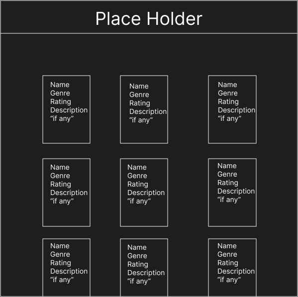
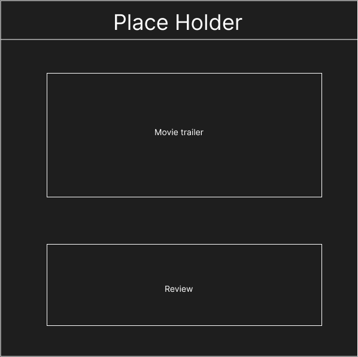
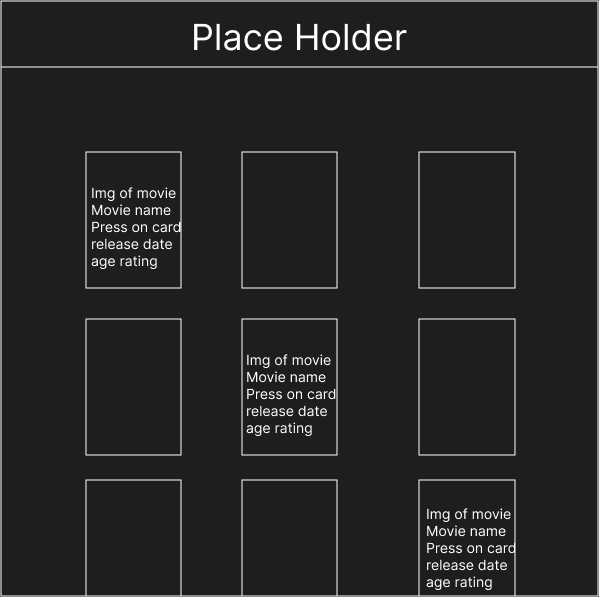

# Your local movie trailer website
## What is this website?
*This was a mini project to test and get used to using API's*

The API that was used is [MovieGLU](https://developer.movieglu.com/)
## Am I satisfied with the website relative to the 
The website itself went according to the requirements specification form except a few changes in the general way that information is shown on the website however the finished version is satisfactory to the standards I set on myself "mainly the functionallity part of the project"
### Originial sketch

### Finished Version

As for the trailer part of the website it is essenstially the same as the sketch except that instead of a review it displays the synopsis of the movie and the name of the movie
Due to the API used not having all the information I originally wanted I adapted to fitting the website to work around it 

-*Since I also couldn't find a suitable API that could get the information I wanted without trading something else off* 
The general styling of the website could be better but I think that the simplistic design works and doesn't overclutter with unnecessary information / items

The work flow during the project steady except during the start when I was looking for a decent API "Not all of them have a good response time and trailers"

## What could I improve?
1. Gitnore - 
The main thing that I should have done before publishing the project is make a gitnore file to ignore a file where the API key was stored "this would have secured the API key further so that only I would have been able to access / see the API key."

2. Minor feature improvements - 
As for the features, something that would have been better to do is adding another API so that finding reviews for the movie would have been possible. Due to the API that is used not having zed data this feature was disconteniued.

## Want to use this project?
If you wish to test this out on your own simply fork the project or download the zip

Don't forget to change some code "Follow the instructions in the code", 

### Goodluck